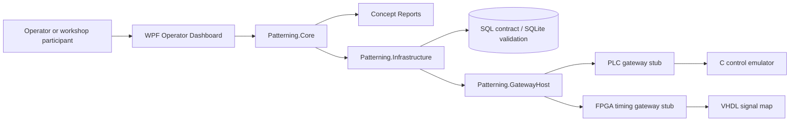
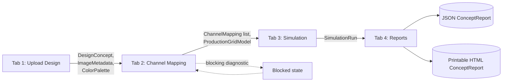
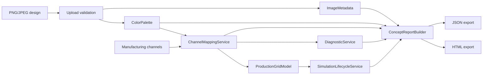

# Architecture

This document is the system map for the Digital Patterning System Simulator. It explains the major boundaries, runtime
flows, data models, and extension points used by the workshop implementation.

## System Purpose

The simulator demonstrates a confidentiality-safe industrial patterning workflow. A design concept moves through upload
validation, image metadata extraction, palette extraction, manufacturing-channel mapping, production-grid conversion,
lifecycle simulation, optional PLC/FPGA gateway stubs, and report export.

The implementation is intentionally broad rather than production-deep so workshop participants can practice GitHub
Copilot, Spec Kit, and multi-agent workflows across C#, WPF, C++, C, SQL, TCP/IP, FPGA, and PLC-style artifacts.

## High-Level System



## Repository Boundaries

| Area | Responsibility |
| --- | --- |
| `workspace/csharp/Patterning.Core/` | Domain models, services, upload validation, palette/channel mapping, diagnostics, lifecycle simulation, report building. |
| `workspace/csharp/PatterningOperatorDashboard/` | Windows WPF operator UI and tab-to-tab workflow state. |
| `workspace/csharp/Patterning.Infrastructure/` | SQL repositories, TCP clients, gateway adapters, infrastructure boundaries. |
| `workspace/csharp/Patterning.GatewayHost/` | Command-line host for PLC and FPGA gateway proof stubs. |
| `workspace/cpp/` | Native examples for image metadata, palette extraction, channel mapping, grid conversion, and command generation. |
| `workspace/control-c/` | C control emulator and protocol helper functions. |
| `workspace/fpga/` | VHDL signal-map stub and GHDL testbench. |
| `workspace/plc/` | Structured Text lifecycle stub and scenario fixture data. |
| `workspace/sql/` | SQL Server-compatible contract plus SQLite validation path. |
| `docs/` | Product requirements documents and explanatory workshop documentation. |
| `specs/` | Spec Kit-generated specifications, plans, tasks, contracts, and checklists. |

## Dashboard Workflow

The WPF dashboard exposes the simulator as four sequential tabs. Each tab consumes state produced by the previous one
through `SessionState`.



## Runtime Flow

1. The Upload tab validates a PNG/JPEG design and publishes `DesignConcept`, `ImageMetadata`, and `ColorPalette` to
   `SessionState`.
2. The Channels tab maps each `PaletteColor` to a `ManufacturingChannel`, computes mapping status and delta, and
   publishes `ChannelMapping` records.
3. The simulator converts mapped colors into a `ProductionGridModel` at 64, 128, or 256 cells per side.
4. Diagnostics identify unresolved mappings, high-delta mappings, or other manufacturability issues. Blocking
   diagnostics prevent simulation start.
5. The Simulation tab runs lifecycle operations: start, pause, resume, reset, complete, and blocked.
6. Optional gateway stubs demonstrate TCP/IP boundaries for PLC lifecycle control and FPGA timing behavior.
7. The Reports tab builds a `ConceptReport` and exports JSON or printable HTML.

## Core Domain Model

| Model | Meaning |
| --- | --- |
| `DesignConcept` | Uploaded design identity and source file information. |
| `ImageMetadata` | Width, height, color space, and bit depth extracted from the image. |
| `ColorPalette` | Representative design colors and coverage percentages. |
| `PaletteColor` | One extracted color swatch from the design palette. |
| `ManufacturingChannel` | One generic machine output slot with label, reference hex color, and sort order. |
| `ChannelMapping` | Assignment of one palette color to one channel with mapping status, delta, and notes. |
| `ProductionGridModel` | Channel-ID grid consumed by the simulated production workflow. |
| `ManufacturabilityDiagnostic` | Warning or blocking error generated from the current mappings and grid. |
| `SimulationRun` | Lifecycle and timing summary for one simulated run. |
| `ConceptReport` | Export bundle containing concept, metadata, palette, channels, mappings, grid, diagnostics, and simulation. |

## Channel Mapping Rule

Channel mapping compares the palette color hex value with the selected channel reference hex value using Euclidean RGB
color distance.

| Status | Rule | Meaning |
| --- | --- | --- |
| `Exact` | Delta is `0` | The selected channel reference color exactly matches the palette color. |
| `Approximate` | Delta is greater than `0` and less than or equal to `80` | The selected channel is close enough for a stable workshop mapping. |
| `Unresolved` | Delta is greater than `80`, or no channel is selected | The mapping should be corrected before simulation. |

The threshold is intentionally simple so workshop participants can reason about it without industrial color-science
background.

## Data Flow



## Gateway Boundaries

The gateway layer is optional for the dashboard workflow but useful for workshop demonstrations.

| Gateway | Purpose | Related Area |
| --- | --- | --- |
| PLC gateway | Demonstrates lifecycle/status commands such as start, pause, resume, reset, and `status.update`. | `workspace/control-c/`, `workspace/plc/` |
| FPGA gateway | Demonstrates deterministic timing and signal-map behavior. | `workspace/fpga/` |

## Persistence Boundary

The simulator should keep live state in memory by default. SQL support is a contract and validation path, not a required
runtime dependency. Add persistence only when the user asks, and keep it optional behind configuration.

## Extension Points

| Feature Area | Preferred Extension Point |
| --- | --- |
| Channel naming or preset schemes | Add models/services in `Patterning.Core`; expose selector in the WPF Channels tab; include scheme details in reports. |
| Mapping quality rules | Update `ChannelMappingService`, diagnostics, and tests that assert mapping status. |
| Dashboard tab behavior | Update the relevant WPF ViewModel first, then keep code-behind minimal. |
| Report content | Extend `ConceptReport`, `ConceptReportBuilder`, exporters, and report tests. |
| Gateway protocol | Update contracts, infrastructure adapters, gateway host behavior, and protocol tests together. |
| SQL schema | Update SQL contracts and SQLite validation scripts without making database access mandatory. |
| Native processing examples | Keep C++ and C examples small, deterministic, and testable through CMake/CTest. |

## Architectural Invariants

- The dashboard tabs are sequential: Upload feeds Channels, Channels feeds Simulation, Simulation feeds Reports.
- Channel mappings are keyed by stable channel IDs, not by display labels.
- Mapping status is derived from selected channel color distance and should not be treated as manually editable state.
- Blocking diagnostics must prevent simulation start.
- Report exports should be self-describing enough for workshop review.
- External services are optional unless a feature explicitly requires them.

## Validation

Run the core C# validation from the repository root:

```powershell
dotnet build workspace/csharp/PatterningSimulator.sln -nologo -v minimal
dotnet test workspace/csharp/PatterningSimulator.sln --configuration Debug
```

For native and FPGA validation paths, see [README.md](README.md).
