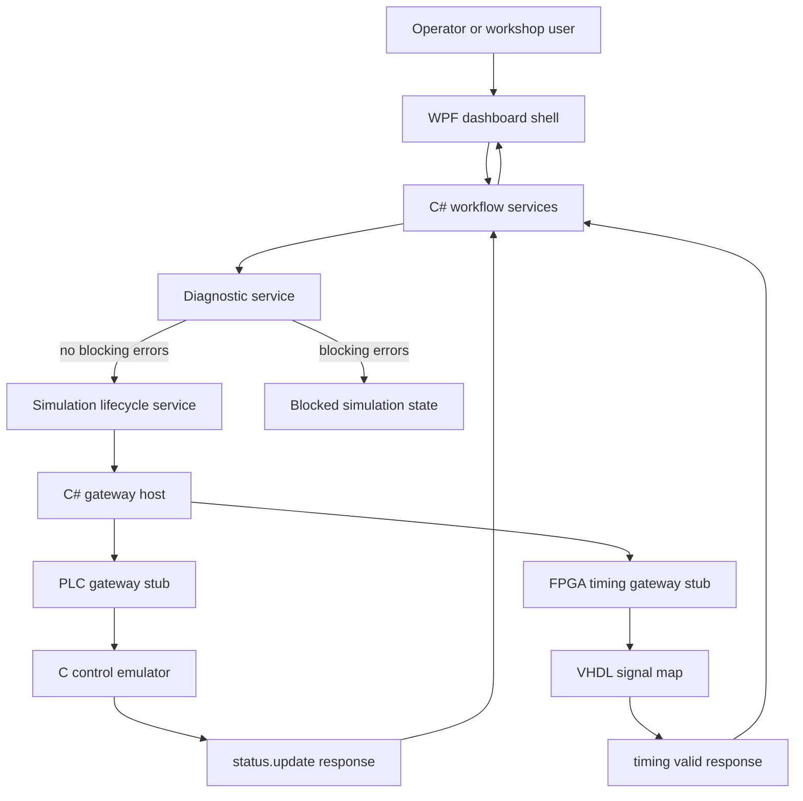
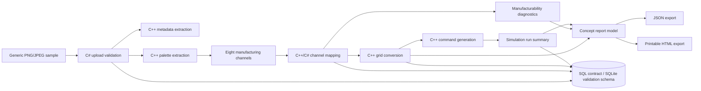

# Digital Patterning System Simulator

> GitHub Copilot workshop reference implementation for an industrial digital patterning simulator.

[](LICENSE)
[](https://dotnet.microsoft.com/)
[](https://isocpp.org/)
[](https://en.cppreference.com/w/c)
[](https://github.com/features/copilot)

## Overview

This repository contains a confidentiality-safe, industrial-stack proof of concept for a digital patterning workflow.
The simulator shows how a design concept can move through image analysis, palette extraction, manufacturing-channel
mapping, production-grid conversion, machine lifecycle simulation, and report export.

The implementation is intentionally broad rather than production-deep. It gives workshop participants a realistic
multi-language codebase for GitHub Copilot and Spec Kit workflows across C#, C++, C, SQL, TCP/IP, Windows, Linux, FPGA,
and PLC-style artifacts.

## Prerequisites

### Must-Have Now

| Requirement | Details |
| --- | --- |
| GitHub account | Required to fork, clone, open Codespaces, and use Copilot-assisted workshop flows. |
| Git | Install from [git-scm.com](https://git-scm.com/downloads) and configure credentials for your GitHub account. |
| VS Code | Recommended editor for Codespaces, Dev Containers, C#, C++, C, SQL, VHDL, and PLC artifacts. |
| GitHub Copilot | Recommended for the workshop exercises; the simulator itself can build and run without Copilot. |

### Additional Tools By Path

| Applies To | Requirement |
| --- | --- |
| Codespaces / Dev Container | No local build tools required beyond a browser or VS Code. The container installs .NET 8, CMake, C/C++ compilers, GHDL, SQLite, Docker-in-Docker, Node.js, GitHub CLI, Spec Kit, PostgreSQL client tooling, and optional cloud/MCP CLIs. |
| Local Linux validation | .NET 8 SDK, CMake, a C++17 compiler, a C11 compiler, Docker, SQLite, and GHDL. |
| Windows dashboard | Windows 10 or later, .NET 8 SDK, Git for Windows, and optionally Visual Studio 2022 or VS Code with C# Dev Kit. |
| SQL validation | Docker-capable host. The validation path uses a disposable SQLite container while preserving the SQL Server-compatible contract. |
| Copilot / Spec Kit workshop flows | GitHub CLI, Spec Kit CLI, and a Copilot-enabled GitHub account. |

### Local Setup Preflight

When running locally, first open the repository in VS Code and run the custom Copilot prompt
`/01.00.install-required-tools-sdks-and-libraries`. The prompt scans the README, PRD, devcontainer, quickstart, and
project manifests for tool or SDK gaps, then aligns setup guidance and devcontainer configuration before you follow the
tutorial commands.

### Permissions And Licensing

| Scenario | Required Access |
| --- | --- |
| Run validation commands | Read access to this repository and permission to run local or containerized tools. |
| Use Codespaces | Codespaces enabled for your GitHub account or organization. |
| Fork for workshop edits | Permission to fork public repositories, or permission to create a copy inside your organization. |
| Push changes or open PRs | Write access to your fork or target repository. |
| Use GitHub Copilot | Copilot Individual, Business, Enterprise, or another license assigned by your organization. |

If your organization restricts Codespaces, Copilot, Docker, or GitHub Actions through policy, confirm those features with
your administrator before the workshop. This repository is licensed under [MIT](LICENSE).

## Choose Your Path

| Path | Time | For | Recommendation |
| --- | --- | --- | --- |
| [Codespaces](#option-a---github-codespaces) | 5-10 min | No local install, easiest validation route | Start here |
| [VS Code Dev Container](#option-b---vs-code-dev-container) | ~15 min | Local VS Code users with Docker Desktop or another container engine | Supported |
| [Manual Linux Setup](#option-c---manual-linux-setup) | ~20 min | Users who prefer direct tool installation | Advanced |
| [Windows Dashboard](#option-d---windows-dashboard) | ~10 min after clone | Running the WPF operator UI | Required for GUI |

### Option A - GitHub Codespaces

1. Open the repository in GitHub.
2. Select **Code** > **Codespaces** > **Create codespace on main**.
3. Wait for the container to finish building. The first build can take a few minutes.
4. Open a terminal and continue with [Validate The Stack](#validate-the-stack).

The Codespaces path is the recommended workshop setup for build, test, SQL, gateway, and FPGA validation. It cannot run
the Windows WPF dashboard.

### Option B - VS Code Dev Container

1. Install [VS Code](https://code.visualstudio.com/), the Dev Containers extension, and Docker Desktop or a compatible
  container engine.
2. Clone or fork the repository using [Fork And Clone](#fork-and-clone).
3. Open the repository folder in VS Code.
4. Run `/01.00.install-required-tools-sdks-and-libraries` in Copilot Chat to check local onboarding and devcontainer
   alignment.
5. When prompted, select **Reopen in Container**. You can also run **Dev Containers: Reopen in Container** from the
  Command Palette.
6. Wait for the container to finish building, then continue with [Validate The Stack](#validate-the-stack).

### Option C - Manual Linux Setup

Before starting, install the local tools listed in [Additional Tools By Path](#additional-tools-by-path).

1. Clone or fork the repository using [Fork And Clone](#fork-and-clone).
2. Open the repository in VS Code and run `/01.00.install-required-tools-sdks-and-libraries` in Copilot Chat.
3. Open a shell at the repository root.
4. Run the commands in [Validate The Stack](#validate-the-stack).

### Option D - Windows Dashboard

Use this path when you want to run the WPF operator dashboard. The dashboard is a Windows desktop app, so use a local
Windows clone instead of trying to launch the UI from Codespaces.

1. Install Git for Windows and the [.NET 8 SDK](https://dotnet.microsoft.com/download/dotnet/8.0).
2. Open PowerShell and clone the repository:

    ```powershell
    git clone https://github.com/multi-layer-perceptron/ghcp-digital-patterning-system-completed.git
    Set-Location ghcp-digital-patterning-system-completed
    ```

3. Open the repository in VS Code and run `/01.00.install-required-tools-sdks-and-libraries` in Copilot Chat.
4. Confirm .NET 8 is available:

    ```powershell
    dotnet --info
    ```

5. Restore and build the solution:

    ```powershell
    dotnet restore workspace/csharp/PatterningSimulator.sln
    dotnet build workspace/csharp/PatterningSimulator.sln --configuration Debug
    ```

6. Optionally run the C# tests:

    ```powershell
    dotnet test workspace/csharp/PatterningSimulator.sln --configuration Debug
    ```

7. Launch the WPF dashboard:

    ```powershell
    dotnet run --project workspace/csharp/PatterningOperatorDashboard
    ```

Expected result: the WPF shell launches with upload, channel mapping, simulation, and report tabs.

## Fork And Clone

Forking is recommended when you plan to edit the repository, open pull requests, or use it as a workshop sandbox.

1. On GitHub, select **Fork**.
2. Clone your fork:

    ```bash
    git clone https://github.com/YOUR-USERNAME/ghcp-digital-patterning-system-completed.git
    cd ghcp-digital-patterning-system-completed
    ```

3. Verify the solution builds:

    ```bash
    dotnet build workspace/csharp/PatterningSimulator.sln --configuration Debug
    ```

If your organization uses GitHub Enterprise Managed Users and cannot fork external repositories, create an empty
repository in your allowed namespace, clone this source repository, then change `origin` to your new repository:

```bash
git clone https://github.com/multi-layer-perceptron/ghcp-digital-patterning-system-completed.git
cd ghcp-digital-patterning-system-completed
git remote set-url origin https://github.com/YOUR-ORG-OR-USER/ghcp-digital-patterning-system-completed.git
git push --all origin
git push --tags origin
```

## Getting Started Tutorial

### Validate The Stack

Run these commands from the repository root. Codespaces and the dev container already include the required tools.

### C# Workflow

```bash
dotnet test workspace/csharp/PatterningSimulator.sln --configuration Debug
```

Expected result: 18 xUnit tests pass across upload validation, channel mapping, lifecycle control, reports, and timing
checks.

### C++ Pattern Processor

```bash
# Configure CMake with -S pointing to the source directory and -B pointing to the build directory.
cmake -S workspace/cpp -B workspace/cpp/build

# Compile the pattern processor and its test binaries using the generated build files.
cmake --build workspace/cpp/build

# Run the CTest suite from the build directory and print failure details if any test fails.
ctest --test-dir workspace/cpp/build --output-on-failure
```

Expected result: image metadata, palette extraction, channel mapping, grid conversion, and command-generation tests pass.

### C Control Emulator

```bash
# Configure CMake with -S pointing to the source directory and -B pointing to the build directory.
cmake -S workspace/control-c -B workspace/control-c/build

# Compile the control emulator and its test binary using the generated build files.
cmake --build workspace/control-c/build

# Run the CTest suite from the build directory and print failure details if any test fails.
ctest --test-dir workspace/control-c/build --output-on-failure
```

Expected result: the C lifecycle and protocol helper test passes.

### SQL With SQLite In Docker

```bash
bash workspace/sql/validate-sqlite-container.sh
```

Expected result: the script starts a disposable SQLite container, applies the schema, and lists the expected simulator
tables.

### FPGA And Gateway Stubs

```bash
ghdl -a workspace/fpga/signal_map.vhd workspace/fpga/signal_map_tb.vhd
ghdl -e signal_map_tb
ghdl -r signal_map_tb --stop-time=20ns
```

```bash
dotnet run --project workspace/csharp/Patterning.GatewayHost -- --gateway plc --port 5120 --scenarios workspace/plc/scenarios/basic-run.json
dotnet run --project workspace/csharp/Patterning.GatewayHost -- --gateway fpga --port 5130 --signal-map workspace/fpga/signal_map.vhd
```

Expected result: GHDL stops at 20 ns, and both gateway commands print a `status.update:*:ready` response.

## Useful Commands

| Task | Command |
| --- | --- |
| Build C# solution | `dotnet build workspace/csharp/PatterningSimulator.sln --configuration Debug` |
| Run C# tests | `dotnet test workspace/csharp/PatterningSimulator.sln --configuration Debug` |
| Run WPF dashboard on Windows | `dotnet run --project workspace/csharp/PatterningOperatorDashboard` |
| Build C++ processor | `cmake -S workspace/cpp -B workspace/cpp/build && cmake --build workspace/cpp/build` |
| Test C++ processor | `ctest --test-dir workspace/cpp/build --output-on-failure` |
| Build C emulator | `cmake -S workspace/control-c -B workspace/control-c/build && cmake --build workspace/control-c/build` |
| Test C emulator | `ctest --test-dir workspace/control-c/build --output-on-failure` |
| Validate SQL schema | `bash workspace/sql/validate-sqlite-container.sh` |
| Run PLC gateway stub | `dotnet run --project workspace/csharp/Patterning.GatewayHost -- --gateway plc --port 5120 --scenarios workspace/plc/scenarios/basic-run.json` |
| Run FPGA gateway stub | `dotnet run --project workspace/csharp/Patterning.GatewayHost -- --gateway fpga --port 5130 --signal-map workspace/fpga/signal_map.vhd` |

## Project Layout

```text
workspace/
  assets/samples/                 Generic sample concept metadata and PNG asset
  csharp/
    PatterningSimulator.sln        .NET solution
    Patterning.Core/               Domain models, services, protocol contracts, reports
    Patterning.Infrastructure/     SQL repositories, TCP client, PLC/FPGA gateway stubs
    Patterning.GatewayHost/        CLI host for gateway proof stubs
    Patterning.Tests/              xUnit workflow and timing tests
    PatterningOperatorDashboard/   WPF operator dashboard shell
  cpp/                             C++17 image analysis, palette, mapping, grid, command logic
  control-c/                       C11 control emulator and protocol helpers
  fpga/                            VHDL signal-map stub and GHDL testbench
  plc/                             Structured Text lifecycle stub and scenario fixture
  sql/                             SQL contract, SQLite validation schema, container runner
specs/001-digital-patterning-simulator/
  spec.md                          Feature specification
  plan.md                          Implementation plan
  tasks.md                         Completed task plan
  quickstart.md                    Full validation flow
  contracts/                       TCP/IP and SQL contracts
docs/
  prd-specify-digital-patterning-system.md
  images/digitial-patterning-infographic.svg
```

## Control Flow



## Data Flow



## Implemented Workflow

1. Validate or select a generic PNG/JPEG sample design.
2. Extract image metadata and a representative color palette.
3. Configure eight generic manufacturing channels.
4. Map palette colors to exact, approximate, or unresolved channel assignments.
5. Convert the mapped design into 64, 128, or 256 production grids.
6. Apply blocking diagnostics before simulation starts.
7. Simulate start, pause, resume, reset, PLC gateway, and FPGA timing gateway behavior.
8. Export structured JSON or printable HTML concept reports.

## Key Documentation

- [Product Requirements Document](docs/prd-specify-digital-patterning-system.md)
- [Feature Quickstart](specs/001-digital-patterning-simulator/quickstart.md)
- [Feature Specification](specs/001-digital-patterning-simulator/spec.md)
- [Implementation Plan](specs/001-digital-patterning-simulator/plan.md)
- [Completed Task List](specs/001-digital-patterning-simulator/tasks.md)
- [TCP/IP Command Protocol](specs/001-digital-patterning-simulator/contracts/tcp-command-protocol.md)
- [SQL Contract](specs/001-digital-patterning-simulator/contracts/sql-schema.sql)

## Notes For Workshop Facilitators

- The project is generic and uses synthetic sample data.
- The WPF dashboard is a Windows desktop surface; Codespaces is for validation and service stubs.
- The SQL Server-compatible contract is preserved, while repeatable local validation uses SQLite in Docker.
- The `digitial` spelling in the infographic file name is retained to match the existing repository asset path.

## License

[MIT](LICENSE)
