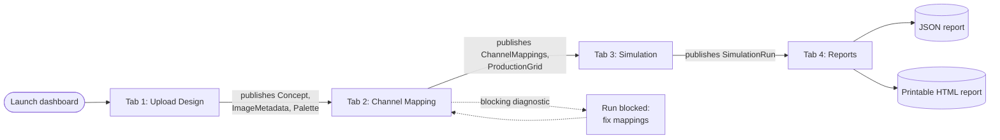
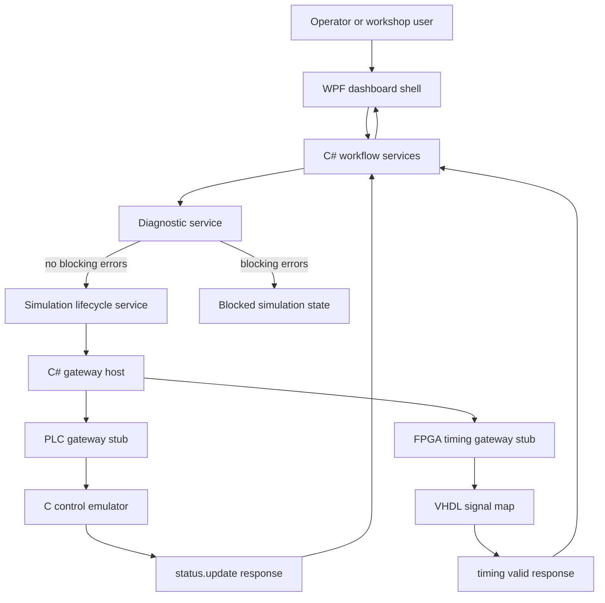
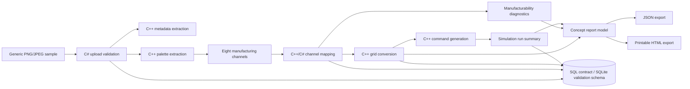

# Digital Patterning System Simulator

> GitHub Copilot workshop reference implementation for an industrial digital patterning simulator.

[](LICENSE)
[](https://dotnet.microsoft.com/)
[](https://isocpp.org/)
[](https://en.cppreference.com/w/c)
[](https://github.com/features/copilot)

## Overview

This repository contains a confidentiality-safe, industrial-stack proof of concept for a digital patterning workflow.
The simulator shows how a design concept can move through image analysis, palette extraction, manufacturing-channel
mapping, production-grid conversion, machine lifecycle simulation, and report export.

The implementation is intentionally broad rather than production-deep. It gives workshop participants a realistic
multi-language codebase for GitHub Copilot and Spec Kit workflows across C#, C++, C, SQL, TCP/IP, Windows, Linux, FPGA,
and PLC-style artifacts.

## Prerequisites

### Must-Have Now

| Requirement | Details |
| --- | --- |
| GitHub account | Required to fork, clone, open Codespaces, and use Copilot-assisted workshop flows. |
| Git | Install from [git-scm.com](https://git-scm.com/downloads) and configure credentials for your GitHub account. |
| VS Code | Recommended editor for Codespaces, Dev Containers, C#, C++, C, SQL, VHDL, and PLC artifacts. |
| GitHub Copilot | Recommended for the workshop exercises; the simulator itself can build and run without Copilot. |

### Additional Tools By Path

| Applies To | Requirement |
| --- | --- |
| Codespaces / Dev Container | No local build tools required beyond a browser or VS Code. The container installs .NET 8, CMake, C/C++ compilers, GHDL, SQLite, Docker-in-Docker, Node.js, GitHub CLI, Spec Kit, PostgreSQL client tooling, and optional cloud/MCP CLIs. |
| Local Linux validation | .NET 8 SDK, CMake, a C++17 compiler, a C11 compiler, Docker, SQLite, and GHDL. |
| Local Windows C/C++ validation | CMake from Kitware and a C/C++ compiler toolchain such as Visual Studio Build Tools. Install CMake with `winget install Kitware.CMake`, open a new terminal, then verify `cmake --version` and `ctest --version`. |
| Windows dashboard | Windows 10 or later, .NET 8 SDK, Git for Windows, and optionally Visual Studio 2022 or VS Code with C# Dev Kit. |
| SQL validation | Docker-capable host. The validation path uses a disposable SQLite container while preserving the SQL Server-compatible contract. |
| Copilot / Spec Kit workshop flows | GitHub CLI, Spec Kit CLI, and a Copilot-enabled GitHub account. |

### Local Setup Preflight

When running locally, first open the repository in VS Code and run the custom Copilot prompt
`/01.00.install-required-tools-sdks-and-libraries`. The prompt scans the README, PRD, devcontainer, quickstart, and
project manifests for tool or SDK gaps, then aligns setup guidance and devcontainer configuration before you follow the
tutorial commands.

### Permissions And Licensing

| Scenario | Required Access |
| --- | --- |
| Run validation commands | Read access to this repository and permission to run local or containerized tools. |
| Use Codespaces | Codespaces enabled for your GitHub account or organization. |
| Fork for workshop edits | Permission to fork public repositories, or permission to create a copy inside your organization. |
| Push changes or open PRs | Write access to your fork or target repository. |
| Use GitHub Copilot | Copilot Individual, Business, Enterprise, or another license assigned by your organization. |

If your organization restricts Codespaces, Copilot, Docker, or GitHub Actions through policy, confirm those features with
your administrator before the workshop. This repository is licensed under [MIT](LICENSE).

## Choose Your Path

| Path | Time | For | Recommendation |
| --- | --- | --- | --- |
| [Codespaces](#option-a---github-codespaces) | 5-10 min | No local install, easiest validation route | Start here |
| [VS Code Dev Container](#option-b---vs-code-dev-container) | ~15 min | Local VS Code users with Docker Desktop or another container engine | Supported |
| [Manual Linux Setup](#option-c---manual-linux-setup) | ~20 min | Users who prefer direct tool installation | Advanced |
| [Manual Windows Validation](#option-d---manual-windows-validation) | ~20 min | Windows users running command-line validation locally | Advanced |
| [Windows Dashboard](#option-e---windows-dashboard) | ~10 min after clone | Running the WPF operator UI | Required for GUI |

### Option A - GitHub Codespaces

1. Open the repository in GitHub.
2. Select **Code** > **Codespaces** > **Create codespace on main**.
3. Wait for the container to finish building. The first build can take a few minutes.
4. Open a terminal and continue with [Validate The Stack](#validate-the-stack).

The Codespaces path is the recommended workshop setup for build, test, SQL, gateway, and FPGA validation. It cannot run
the Windows WPF dashboard.

### Option B - VS Code Dev Container

1. Install [VS Code](https://code.visualstudio.com/), the Dev Containers extension, and Docker Desktop or a compatible
  container engine.
2. Clone or fork the repository using [Fork And Clone](#fork-and-clone).
3. Open the repository folder in VS Code.
4. Run `/01.00.install-required-tools-sdks-and-libraries` in Copilot Chat to check local onboarding and devcontainer
   alignment.
5. When prompted, select **Reopen in Container**. You can also run **Dev Containers: Reopen in Container** from the
  Command Palette.
6. Wait for the container to finish building, then continue with [Validate The Stack](#validate-the-stack).

### Option C - Manual Linux Setup

Before starting, install the local tools listed in [Additional Tools By Path](#additional-tools-by-path).

1. Clone or fork the repository using [Fork And Clone](#fork-and-clone).
2. Open the repository in VS Code and run `/01.00.install-required-tools-sdks-and-libraries` in Copilot Chat.
3. Open a shell at the repository root.
4. Run the commands in [Validate The Stack](#validate-the-stack).

### Option D - Manual Windows Validation

Use this path when you want to run the command-line C#, C++, C, SQL, gateway, or FPGA validation from Windows without a
Dev Container. For the WPF dashboard GUI, continue with [Windows Dashboard](#option-e---windows-dashboard).

1. Install Git for Windows and the [.NET 8 SDK](https://dotnet.microsoft.com/download/dotnet/8.0).
2. Install CMake from the official Kitware package source:

    ```powershell
    winget install Kitware.CMake
    ```

3. Install a C/C++ compiler toolchain, such as Visual Studio Build Tools with the Desktop development with C++ workload.
4. Open a new PowerShell terminal so PATH changes are loaded, then verify:

    ```powershell
    cmake --version
    ctest --version
    dotnet --info
    ```

5. Clone or fork the repository using [Fork And Clone](#fork-and-clone).
6. Open the repository in VS Code and run `/01.00.install-required-tools-sdks-and-libraries` in Copilot Chat.
7. Run **Terminal: Run Task** > **Native: Test C++ And C** for native validation, or use the Windows command examples in
  [Validate The Stack](#validate-the-stack). The committed VS Code tasks use short build directories under `C:/temp` to
  avoid MSBuild file-tracking failures from long OneDrive workspace paths.

### Option E - Windows Dashboard

Use this path when you want to run the WPF operator dashboard. The dashboard is a Windows desktop app, so use a local
Windows clone instead of trying to launch the UI from Codespaces.

1. Install Git for Windows and the [.NET 8 SDK](https://dotnet.microsoft.com/download/dotnet/8.0).
2. Open PowerShell and clone the repository:

    ```powershell
    git clone https://github.com/multi-layer-perceptron/ghcp-digital-patterning-system-completed.git
    Set-Location ghcp-digital-patterning-system-completed
    ```

3. Open the repository in VS Code and run `/01.00.install-required-tools-sdks-and-libraries` in Copilot Chat.
4. Confirm .NET 8 is available:

    ```powershell
    dotnet --info
    ```

5. Restore and build the solution:

    ```powershell
    dotnet restore workspace/csharp/PatterningSimulator.sln
    dotnet build workspace/csharp/PatterningSimulator.sln --configuration Debug
    ```

6. Optionally run the C# tests:

    ```powershell
    dotnet test workspace/csharp/PatterningSimulator.sln --configuration Debug
    ```

7. Launch the WPF dashboard:

    ```powershell
    dotnet run --project workspace/csharp/PatterningOperatorDashboard
    ```

Expected result: the WPF shell launches with upload, channel mapping, simulation, and report tabs.

## Fork And Clone

Forking is recommended when you plan to edit the repository, open pull requests, or use it as a workshop sandbox.

1. On GitHub, select **Fork**.
2. Clone your fork:

    ```bash
    git clone https://github.com/YOUR-USERNAME/ghcp-digital-patterning-system-completed.git
    cd ghcp-digital-patterning-system-completed
    ```

3. Verify the solution builds:

    ```bash
    dotnet build workspace/csharp/PatterningSimulator.sln --configuration Debug
    ```

If your organization uses GitHub Enterprise Managed Users and cannot fork external repositories, create an empty
repository in your allowed namespace, clone this source repository, then change `origin` to your new repository:

```bash
git clone https://github.com/multi-layer-perceptron/ghcp-digital-patterning-system-completed.git
cd ghcp-digital-patterning-system-completed
git remote set-url origin https://github.com/YOUR-ORG-OR-USER/ghcp-digital-patterning-system-completed.git
git push --all origin
git push --tags origin
```

## Getting Started Tutorial

### Validate The Stack

Run these commands from the repository root. Codespaces and the dev container already include the required tools.

### C# Workflow

```bash
dotnet test workspace/csharp/PatterningSimulator.sln --configuration Debug
```

Expected result: 18 xUnit tests pass across upload validation, channel mapping, lifecycle control, reports, and timing
checks.

### C++ Pattern Processor

Use the default commands in Codespaces, the Dev Container, and typical Linux/macOS shells:

```bash
# Configure CMake with -S pointing to the source directory and -B pointing to the build directory.
cmake -S workspace/cpp -B workspace/cpp/build

# Compile the pattern processor and its test binaries using the generated build files.
cmake --build workspace/cpp/build

# Run the CTest suite from the build directory and print failure details if any test fails.
ctest --test-dir workspace/cpp/build --output-on-failure
```

On local Windows clones under a long OneDrive or synced-folder path, Visual Studio/MSBuild can fail during CMake compiler
detection with `FTK1011` file-tracking errors in generated `.tlog` files. In that case, use the committed VS Code task
**Native: Test C++ And C** or run the C++ workflow with a short external build directory:

```powershell
# Configure CMake with -S pointing to the in-repo source directory and -B pointing to a short external
# build directory under C:/temp to avoid MSBuild FileTracker FTK1011 errors from long OneDrive paths.
cmake -S workspace/cpp -B C:/temp/ghcp-digital-patterning-system-completed/cpp-build

# Compile the pattern processor and its test binaries from the short external build directory using
# the Debug configuration, which matches the committed VS Code tasks.
cmake --build C:/temp/ghcp-digital-patterning-system-completed/cpp-build --config Debug

# Run the CTest suite from the short external build directory in Debug mode and print failure details
# if any test fails.
ctest --test-dir C:/temp/ghcp-digital-patterning-system-completed/cpp-build -C Debug --output-on-failure
```

Expected result: image metadata, palette extraction, channel mapping, grid conversion, and command-generation tests pass.

### C Control Emulator

Use the default commands in Codespaces, the Dev Container, and typical Linux/macOS shells:

```bash
# Configure CMake with -S pointing to the source directory and -B pointing to the build directory.
cmake -S workspace/control-c -B workspace/control-c/build

# Compile the control emulator and its test binary using the generated build files.
cmake --build workspace/control-c/build

# Run the CTest suite from the build directory and print failure details if any test fails.
ctest --test-dir workspace/control-c/build --output-on-failure
```

For local Windows validation from a long synced path, use the committed VS Code task **Native: Test C++ And C** or a short
external build directory:

```powershell
# Configure CMake with -S pointing to the in-repo source directory and -B pointing to a short external
# build directory under C:/temp to avoid MSBuild FileTracker FTK1011 errors from long OneDrive paths.
cmake -S workspace/control-c -B C:/temp/ghcp-digital-patterning-system-completed/control-c-build

# Compile the control emulator and its test binary from the short external build directory using the
# Debug configuration, which matches the committed VS Code tasks.
cmake --build C:/temp/ghcp-digital-patterning-system-completed/control-c-build --config Debug

# Run the CTest suite from the short external build directory in Debug mode and print failure details
# if any test fails.
ctest --test-dir C:/temp/ghcp-digital-patterning-system-completed/control-c-build -C Debug --output-on-failure
```

Expected result: the C lifecycle and protocol helper test passes.

### SQL With SQLite In Docker

```bash
bash workspace/sql/validate-sqlite-container.sh
```

Expected result: the script starts a disposable SQLite container, applies the schema, and lists the expected simulator
tables.

### FPGA And Gateway Stubs

Use the default commands in Codespaces, the Dev Container, and typical Linux/macOS shells (GHDL is preinstalled in the
devcontainer image):

```bash
# Analyze (compile) the VHDL entity and its testbench together.
ghdl -a workspace/fpga/signal_map.vhd workspace/fpga/signal_map_tb.vhd

# Elaborate the testbench entity into an executable simulation.
ghdl -e signal_map_tb

# Run the simulation, stopping after 20 ns of simulated time.
ghdl -r signal_map_tb --stop-time=20ns
```

On local Windows clones, GHDL is **not** bundled with Visual Studio or the .NET SDK and is not on PATH by default. If
`ghdl` reports `The term 'ghdl' is not recognized`, install one of the supported Windows builds (the `mcode` backend is
the simplest because it requires no LLVM or GCC toolchain), then re-open PowerShell and re-run the commands above:

```powershell
# Option 1 - Scoop (no admin required). Install Scoop first if you do not already have it.
Set-ExecutionPolicy -Scope CurrentUser RemoteSigned
Invoke-RestMethod -Uri https://get.scoop.sh | Invoke-Expression

# Install GHDL from Scoop's main bucket (ships the mcode backend on Windows; no LLVM or GCC required).
scoop install main/ghdl

# Option 2 - Manual install from the official GHDL GitHub releases.
# 1. Download the latest ghdl-<version>-mingw64-mcode.zip from https://github.com/ghdl/ghdl/releases
# 2. Extract to C:\Tools\ghdl
# 3. Add C:\Tools\ghdl\bin to your User PATH (System Properties > Environment Variables).

# Verify in a NEW PowerShell window so PATH is refreshed.
ghdl --version
```

GHDL is only required for the FPGA lab. The C++, C, .NET, SQL, and PLC labs work without it, and the FPGA lab also runs
unchanged in Codespaces or the Dev Container if you prefer not to install GHDL on Windows.

After GHDL is available, start the gateway stubs:

```bash
dotnet run --project workspace/csharp/Patterning.GatewayHost -- --gateway plc --port 5120 --scenarios workspace/plc/scenarios/basic-run.json
dotnet run --project workspace/csharp/Patterning.GatewayHost -- --gateway fpga --port 5130 --signal-map workspace/fpga/signal_map.vhd
```

Expected result: GHDL stops at 20 ns, and both gateway commands print a `status.update:*:ready` response.

## Operator Dashboard Tutorial

The WPF operator dashboard is the workshop's main hands-on surface. It walks an operator through the same pipeline the
validation commands exercise: take a design, decide how the machine will reproduce it, simulate a run, and export a
report. The shell is organized as four tabs that must be used in order, because each tab consumes state produced by the
previous one.

### Dashboard Workflow Diagram



Each tab reads from and writes to a shared in-memory `SessionState` singleton. Moving forward without completing the
previous tab will show empty summaries; that is intentional so workshop participants can see exactly which step produces
which artifact.

### Tab 1 - Upload Design

Purpose: bring a design image into the simulator and turn it into a `DesignConcept` with extracted metadata and a color
palette.

How to use it:

1. Click **Browse** to pick a PNG or JPEG from disk (up to 10 MB, 4096 x 4096 px), or click **Load Sample** to use the
   bundled generic floorcovering sample.
2. Watch the summary panel populate with the file name, dimensions, color space, and the extracted palette swatches.
3. If validation fails (unsupported format, oversize, unreadable), a red status message explains why; fix the input and
   try again.

What the tab produces: a `DesignConcept`, an `ImageMetadata` record (dimensions, color space, bit depth), and a
`ColorPalette` (list of `PaletteColor` swatches with coverage percentages). All three are pushed to `SessionState`.

### Tab 2 - Channel Mapping

Purpose: tell the simulated machine **how** to reproduce each color in the design by assigning every palette color to one
of the eight generic manufacturing channels.

How to use it:

1. Review the palette swatches on the left and the eight channel slots on the right.
2. For each palette color, pick a channel from the dropdown. The **Delta** column shows the color distance between the
   palette color and the channel; smaller is better.
3. Optionally rename a channel or change its reference hex to match the materials your scenario assumes (yarn color,
   ink, dye, fiber blend, etc.).
4. Click **Apply Mappings**. The diagnostics panel will list any issues - unmapped colors, mappings with a delta above
   the threshold, duplicates, or other manufacturability problems.
5. If a diagnostic is marked **Blocking**, you cannot start a simulation until you fix it. Re-map and click **Apply
   Mappings** again.

What the tab produces: a list of `ChannelMapping` records and a `ProductionGridModel` (the design re-expressed as a grid
of channel IDs at the chosen resolution).

### Tab 3 - Simulation

Purpose: run the production grid through the simulated lifecycle (start, pause, resume, reset) and watch the gateway
stubs respond.

How to use it:

1. Choose a grid size (64, 128, or 256) - higher resolution means more cells and more channel switches.
2. Click **Start** to begin the run. The status indicator moves through `Running` and finishes at `Completed`. If a
   blocking diagnostic exists, the status moves to `Blocked` and the run never starts - return to the Channel Mapping
   tab and fix the issue.
3. Use **Pause** and **Resume** to verify the lifecycle handshake; use **Reset** to return to a fresh state.
4. Optional: start the PLC or FPGA gateway stub in a separate terminal (see [Useful Commands](#useful-commands)) to see
   the dashboard exchange `status.update` and timing messages over TCP/IP.

What the tab produces: a `SimulationRun` record with pass-by-pass command counts, channel switch counts, elapsed
simulated time, and the final lifecycle state. This is the artifact the Reports tab summarizes.

### Tab 4 - Reports

Purpose: assemble a `ConceptReport` from everything the previous tabs produced and export it for review.

How to use it:

1. Click **Generate** to build (or rebuild) the report from current `SessionState`. The summary panel shows concept,
   palette, channels, grid, simulation, and diagnostics sections.
2. Click **Export JSON** to save a structured report suitable for downstream tooling, or **Export HTML** for a
   printable, human-readable version.
3. The last export path is shown at the bottom of the tab so you can find the file quickly.

What the tab produces: a JSON or HTML file on disk; the in-memory `ConceptReport` is not persisted automatically.

### Glossary For Workshop Participants

These terms appear throughout the dashboard, the code, and the PRD. They are deliberately generic because the simulator
is not tied to any specific machine vendor or material.

| Term | Plain-language meaning |
| --- | --- |
| **Design concept** | The uploaded image plus its metadata and palette - the "what to print" object the pipeline operates on. |
| **Image metadata** | Width, height, color space, and bit depth extracted from the uploaded image. |
| **Color palette** | The handful of representative colors found in the design, each with a coverage percentage. The simulator does not print pixel-perfect; it reduces the design to a palette and reproduces it through channels. |
| **Palette color** | One swatch in the palette - the design's *requested* color. |
| **Manufacturing channel** | One of eight generic output slots on the simulated machine - a yarn color, dye, ink head, fiber blend, or any other physical material feed. Channels model machine capability; they are editable (label + reference hex) so participants can pretend the machine is a tufter, a digital printer, a weaving loom, etc. |
| **Channel mapping** | The decision "render palette color X using channel Y." Stored as a `ChannelMapping` with a status (Exact / Approximate / Unresolved) and a numeric **delta** representing color distance. |
| **Delta** | A numeric score for how far a chosen channel is from the palette color it represents. Lower is better; large deltas usually trigger a diagnostic. |
| **Manufacturability diagnostic** | A warning or blocking error about the current mapping set - for example, "palette color #4 is unmapped" or "delta above threshold for channel 2." Blocking diagnostics stop the simulation from starting. |
| **Production grid** | The design re-expressed as a grid of channel IDs at 64, 128, or 256 cells per side. It is what the simulated machine actually consumes. |
| **Channel switch** | A point in the production grid where two adjacent cells use different channels. The machine has to "swap material," which is a real-world cost; the report counts these. |
| **Simulation run** | One execution of the lifecycle (start, pause, resume, reset). It records pass-by-pass commands, channel switches, elapsed simulated time, and the final state (Completed, Blocked, Reset). |
| **Concept report** | The bundle of concept, palette, mappings, grid summary, simulation summary, and diagnostics that the Reports tab exports as JSON or HTML. |
| **Gateway** | A stub TCP/IP service that pretends to be a PLC controller or FPGA timing module. The dashboard can talk to it over `status.update`/timing messages to demonstrate the protocol boundary. |
| **PLC (Programmable Logic Controller)** | An industrial computer that runs lifecycle/state logic (start/pause/resume/reset). Modeled here by the C control emulator and a Structured Text stub. |
| **FPGA (Field-Programmable Gate Array)** | A configurable chip used for fast, deterministic signal routing. Modeled here by the VHDL `signal_map` and its GHDL testbench. |
| **Lifecycle state** | The simulator's high-level run state: `Idle`, `Running`, `Paused`, `Completed`, `Blocked`, `Reset`. |

## Useful Commands

| Task | Command |
| --- | --- |
| Build C# solution | `dotnet build workspace/csharp/PatterningSimulator.sln --configuration Debug` |
| Run C# tests | `dotnet test workspace/csharp/PatterningSimulator.sln --configuration Debug` |
| Run WPF dashboard on Windows | `dotnet run --project workspace/csharp/PatterningOperatorDashboard` |
| Build C++ processor | `cmake -S workspace/cpp -B workspace/cpp/build && cmake --build workspace/cpp/build` |
| Test C++ processor | `ctest --test-dir workspace/cpp/build --output-on-failure` |
| Build C emulator | `cmake -S workspace/control-c -B workspace/control-c/build && cmake --build workspace/control-c/build` |
| Test C emulator | `ctest --test-dir workspace/control-c/build --output-on-failure` |
| Validate SQL schema | `bash workspace/sql/validate-sqlite-container.sh` |
| Run PLC gateway stub | `dotnet run --project workspace/csharp/Patterning.GatewayHost -- --gateway plc --port 5120 --scenarios workspace/plc/scenarios/basic-run.json` |
| Run FPGA gateway stub | `dotnet run --project workspace/csharp/Patterning.GatewayHost -- --gateway fpga --port 5130 --signal-map workspace/fpga/signal_map.vhd` |

## Project Layout

```text
workspace/
  assets/samples/                 Generic sample concept metadata and PNG asset
  csharp/
    PatterningSimulator.sln        .NET solution
    Patterning.Core/               Domain models, services, protocol contracts, reports
    Patterning.Infrastructure/     SQL repositories, TCP client, PLC/FPGA gateway stubs
    Patterning.GatewayHost/        CLI host for gateway proof stubs
    Patterning.Tests/              xUnit workflow and timing tests
    PatterningOperatorDashboard/   WPF operator dashboard shell
  cpp/                             C++17 image analysis, palette, mapping, grid, command logic
  control-c/                       C11 control emulator and protocol helpers
  fpga/                            VHDL signal-map stub and GHDL testbench
  plc/                             Structured Text lifecycle stub and scenario fixture
  sql/                             SQL contract, SQLite validation schema, container runner
specs/001-digital-patterning-simulator/
  spec.md                          Feature specification
  plan.md                          Implementation plan
  tasks.md                         Completed task plan
  quickstart.md                    Full validation flow
  contracts/                       TCP/IP and SQL contracts
docs/
  prd-specify-digital-patterning-system.md
  images/solution-architecture.mmd
```

## Control Flow



## Data Flow



## Implemented Workflow

1. Validate or select a generic PNG/JPEG sample design.
2. Extract image metadata and a representative color palette.
3. Configure eight generic manufacturing channels.
4. Map palette colors to exact, approximate, or unresolved channel assignments.
5. Convert the mapped design into 64, 128, or 256 production grids.
6. Apply blocking diagnostics before simulation starts.
7. Simulate start, pause, resume, reset, PLC gateway, and FPGA timing gateway behavior.
8. Export structured JSON or printable HTML concept reports.

## Key Documentation

- [Product Requirements Document](docs/prd-specify-digital-patterning-system.md)
- [Feature Quickstart](specs/001-digital-patterning-simulator/quickstart.md)
- [Feature Specification](specs/001-digital-patterning-simulator/spec.md)
- [Implementation Plan](specs/001-digital-patterning-simulator/plan.md)
- [Completed Task List](specs/001-digital-patterning-simulator/tasks.md)
- [TCP/IP Command Protocol](specs/001-digital-patterning-simulator/contracts/tcp-command-protocol.md)
- [SQL Contract](specs/001-digital-patterning-simulator/contracts/sql-schema.sql)

## Notes For Workshop Facilitators

- The project is generic and uses synthetic sample data.
- The WPF dashboard is a Windows desktop surface; Codespaces is for validation and service stubs.
- The SQL Server-compatible contract is preserved, while repeatable local validation uses SQLite in Docker.
- The solution architecture infographic source lives at `docs/images/solution-architecture.mmd`.

## License

[MIT](LICENSE)
