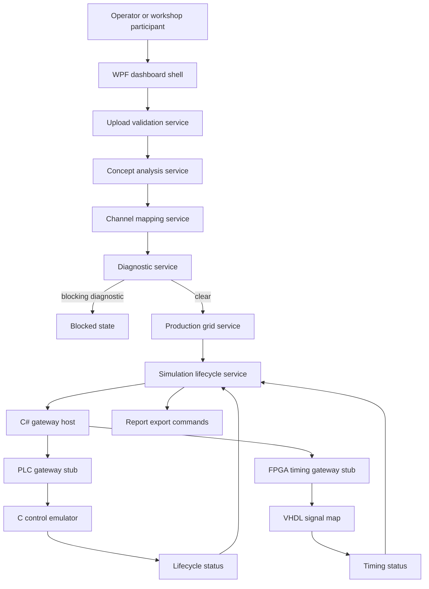
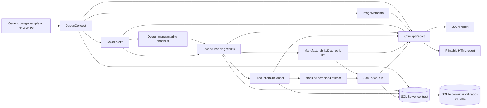
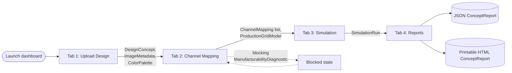

# Product Requirements Document: Digital Patterning System Simulator

## Document Control

- File name: `docs/prd-specify-digital-patterning-system.md`
- Owner: Workshop engineering lead
- Stakeholders: Development Software Engineers, controls engineers, design reviewers, workshop facilitators
- Status: Approved
- Created: 2026-05-14
- Last updated: 2026-05-19
- Target release or lab milestone: Spec Kit implementation baseline

## Summary

The Digital Patterning System Simulator is a confidentiality-safe workshop reference implementation for a representative
industrial patterning workflow. It models how a design concept moves from image upload or sample selection through
metadata extraction, palette analysis, manufacturing-channel mapping, production-grid conversion, simulated machine
lifecycle control, and report export.

The simulator is implemented across the requested industrial stack: C#/.NET 8, C++17, C11, SQL, TCP/IP, Windows, Linux,
FPGA VHDL, and PLC Structured Text. The Linux Codespaces/dev-container environment supports build, test, validation,
and service-stub workflows. The WPF operator dashboard is a Windows desktop app and must be launched on Windows.

## Problem Statement

Industrial patterning software often spans dashboard code, processing logic, machine protocol boundaries, persistence,
controls, and signal-timing artifacts. Engineers need a compact but realistic codebase where GitHub Copilot and Spec Kit
can demonstrate cross-language planning, implementation, validation, and review without exposing sensitive operational
details or requiring physical equipment.

## Goals

- Provide a runnable proof-of-concept simulator for digital patterning workflows.
- Demonstrate Spec Kit-driven implementation across C#, C++, C, SQL, TCP/IP, PLC, and FPGA artifacts.
- Keep the codebase usable in Linux Codespaces for validation and in Windows for the WPF dashboard.
- Use generic sample data and terminology throughout documentation, code, and reports.
- Preserve clear, focused module boundaries suitable for Copilot-assisted workshop exercises.

## Non-Goals

- Production machine control or connection to physical PLC/FPGA hardware.
- Production-ready image processing, color science, or optimization algorithms.
- Authentication, authorization, tenancy, or external identity integration.
- Cloud deployment as a requirement for the baseline simulator.
- Running the WPF dashboard GUI inside Linux Codespaces.

## Users And Personas

| Persona | Needs | Success Looks Like |
| --- | --- | --- |
| Development Software Engineer | Validate a multi-language industrial workflow locally | Builds and tests the complete stack from the quickstart |
| Workshop Participant | Learn Copilot and Spec Kit on realistic artifacts | Completes implementation and validation tasks without physical equipment |
| Workshop Facilitator | Demo the simulator repeatably | Runs validation commands and explains Windows vs Linux run paths |
| Design Reviewer | Inspect concept output summaries | Reviews palette, mapping, diagnostics, grid, and report outputs |
| Controls Engineer | Understand lifecycle and timing boundaries | Reviews PLC, C emulator, TCP/IP, and FPGA stubs together |

## Setup And Access Requirements

The product baseline shall document setup choices in the same workshop-friendly style as the root README: required tools,
which tools are included by the devcontainer, what requires Windows, and what permissions a participant needs before a
session begins.

### Prerequisite Assumptions

| Requirement | Product Expectation |
| --- | --- |
| GitHub account | Users can clone or fork the repository and open Codespaces when available. |
| Git | Users can clone the source or their fork and manage remotes for workshop changes. |
| VS Code | Users can open the repository locally, in Codespaces, or in a Dev Container. |
| GitHub Copilot | Recommended for workshop exercises; not required to run simulator validation commands. |

### Supported Setup Paths

| Path | Purpose | Included Or Required Tools |
| --- | --- | --- |
| GitHub Codespaces | Primary workshop validation path with minimal local setup | Devcontainer-provided .NET 8, CMake, C/C++ compilers, GHDL, SQLite, Docker-in-Docker, Node.js, GitHub CLI, Spec Kit, PostgreSQL client tooling, and optional cloud/MCP CLIs |
| VS Code Dev Container | Local containerized validation path | VS Code, Dev Containers extension, Docker Desktop or compatible container engine |
| Manual Linux setup | Direct local validation path | .NET 8 SDK, CMake, C++17 compiler, C11 compiler, Docker, SQLite, and GHDL |
| Manual Windows validation | Direct local validation path for command-line workflows | .NET 8 SDK, CMake from Kitware, Visual Studio Build Tools or compatible C/C++ compiler, Git for Windows, and optional Docker/GHDL |
| Windows dashboard | Required path for the WPF operator dashboard GUI | Windows 10 or later, Git for Windows, .NET 8 SDK, optional Visual Studio 2022 or VS Code with C# Dev Kit |
| Local setup preflight | Required Copilot-assisted check before local execution paths | Run `/01.00.install-required-tools-sdks-and-libraries` in VS Code to scan setup docs, manifests, and devcontainer alignment |

### Permissions And Licensing

| Scenario | Product Expectation |
| --- | --- |
| Run validation commands | Read access to the repository and permission to run local or containerized tools. |
| Use Codespaces | Codespaces enabled for the user's GitHub account or organization. |
| Fork for workshop edits | Permission to fork public repositories, or permission to create a copy inside an approved organization namespace. |
| Push changes or open pull requests | Write access to the user's fork or target repository. |
| Use GitHub Copilot workflows | Copilot license assigned by the user or organization. |

The baseline is licensed under MIT. If an organization restricts Codespaces, Copilot, Docker, or GitHub Actions through
policy, facilitators should confirm availability before the workshop.

## Getting Started Tutorial

Users should first choose an environment path: Codespaces for the lowest-friction validation route, a local Dev Container
for Docker-based local development, manual Linux setup for direct tool installation, or Windows for the WPF dashboard.
Forking is recommended when users intend to save workshop changes, open pull requests, or adapt the simulator.
For local execution paths, users should run `/01.00.install-required-tools-sdks-and-libraries` in VS Code before running
the tutorial commands so tool, SDK, and devcontainer gaps are found early.

### Tutorial 1: Validate The Stack In Codespaces

1. Open the repository in Codespaces or the VS Code dev container.
2. Run the C# tests:

   ```bash
   dotnet test workspace/csharp/PatterningSimulator.sln --configuration Debug
   ```

3. Run C++ validation:

   ```bash
   cmake -S workspace/cpp -B workspace/cpp/build
   cmake --build workspace/cpp/build
   ctest --test-dir workspace/cpp/build --output-on-failure
   ```

4. Run C control validation:

   ```bash
   cmake -S workspace/control-c -B workspace/control-c/build
   cmake --build workspace/control-c/build
   ctest --test-dir workspace/control-c/build --output-on-failure
   ```

5. Validate SQL in Dockerized SQLite:

   ```bash
   bash workspace/sql/validate-sqlite-container.sh
   ```

6. Validate FPGA and gateway stubs:

   ```bash
   ghdl -a workspace/fpga/signal_map.vhd workspace/fpga/signal_map_tb.vhd
   ghdl -e signal_map_tb
   ghdl -r signal_map_tb --stop-time=20ns
   dotnet run --project workspace/csharp/Patterning.GatewayHost -- --gateway plc --port 5120 --scenarios workspace/plc/scenarios/basic-run.json
   dotnet run --project workspace/csharp/Patterning.GatewayHost -- --gateway fpga --port 5130 --signal-map workspace/fpga/signal_map.vhd
   ```

### Tutorial 2: Run The Dashboard On Windows

This tutorial covers the Windows-only UI path. It is intentionally separate from Codespaces because WPF requires the
Windows desktop runtime.

1. Use a Windows machine with Git for Windows and the .NET 8 SDK installed.
2. Open PowerShell and clone the merged repository locally:

   ```powershell
   git clone https://github.com/multi-layer-perceptron/ghcp-digital-patterning-system-completed.git
   cd ghcp-digital-patterning-system-completed
   ```

3. Confirm the SDK is available:

   ```powershell
   dotnet --info
   ```

4. Restore and build the solution:

   ```powershell
   dotnet restore workspace/csharp/PatterningSimulator.sln
   dotnet build workspace/csharp/PatterningSimulator.sln --configuration Debug
   ```

5. Optionally run the C# tests:

   ```powershell
   dotnet test workspace/csharp/PatterningSimulator.sln --configuration Debug
   ```

6. Launch the WPF dashboard:

   ```powershell
   dotnet run --project workspace/csharp/PatterningOperatorDashboard
   ```

7. Confirm the WPF shell opens with upload, channel mapping, simulation, and report tabs.

## Control Flow



## Data Flow



## Operator Dashboard Workflow

The WPF operator dashboard is the primary user-facing surface. It exposes the same pipeline as the data flow above
through four sequential tabs. Each tab consumes the state produced by the previous one through a shared
`SessionState` singleton, so the tabs must be used in order.



| Tab | Inputs From SessionState | Operator Action | Outputs Published To SessionState |
| --- | --- | --- | --- |
| Upload Design | (none) | Browse to a PNG/JPEG or load the bundled sample. | `DesignConcept`, `ImageMetadata`, `ColorPalette` |
| Channel Mapping | `ColorPalette` | Assign each palette color to one of eight editable manufacturing channels; review diagnostics. | `ChannelMapping[]`, `ProductionGridModel` |
| Simulation | `ProductionGridModel`, mappings, diagnostics | Choose grid size; run start, pause, resume, reset. Blocked state if a blocking diagnostic exists. | `SimulationRun` |
| Reports | All of the above | Generate the report; export JSON or printable HTML. | `ConceptReport` (in-memory) + on-disk export |

## Glossary

These terms appear in the dashboard, code, contracts, and reports. They are deliberately generic so workshop participants
who are new to industrial patterning systems can map them onto whatever physical machine their scenario assumes (digital
printer, tufter, weaver, dye applicator, etc.).

| Term | Meaning |
| --- | --- |
| Design concept | The uploaded image plus its metadata and palette - the object the pipeline operates on. |
| Image metadata | Width, height, color space, and bit depth extracted from the uploaded image. |
| Color palette | The representative colors found in the design, each with a coverage percentage. |
| Palette color | One swatch in the palette - the *requested* color. |
| Manufacturing channel | One of eight generic output slots on the simulated machine (yarn color, dye, ink head, fiber blend, or any other material feed). Channels model machine capability and are editable. |
| Channel mapping | The assignment of a palette color to a channel, with status (Exact, Approximate, Unresolved) and a delta. |
| Delta | Numeric color distance between a palette color and the channel chosen to reproduce it; lower is better. |
| Manufacturability diagnostic | A warning or blocking error about the current mapping set. Blocking diagnostics prevent simulation start. |
| Production grid | The design re-expressed as a grid of channel IDs at 64, 128, or 256 cells per side. |
| Channel switch | A transition between adjacent grid cells that use different channels; counted as a real-world cost in the report. |
| Simulation run | One lifecycle execution recording pass-by-pass commands, channel switches, elapsed simulated time, and the final state. |
| Concept report | The bundle of concept, palette, mappings, grid summary, simulation summary, and diagnostics exported as JSON or HTML. |
| Gateway | A stub TCP/IP service representing a PLC controller or FPGA timing module. |
| PLC | Programmable Logic Controller - the lifecycle/state layer, modeled by the C control emulator and a Structured Text stub. |
| FPGA | Field-Programmable Gate Array - the deterministic signal-routing layer, modeled by the VHDL `signal_map` and its GHDL testbench. |
| Lifecycle state | The simulator's high-level run state: `Idle`, `Running`, `Paused`, `Completed`, `Blocked`, `Reset`. |

## Functional Requirements

| ID | Requirement | Priority | Status |
| --- | --- | --- | --- |
| FR-001 | The system shall validate PNG/JPEG design inputs up to 10 MB and 4096 x 4096 pixels. | Must | Implemented |
| FR-002 | The system shall include a generic sample design and metadata. | Must | Implemented |
| FR-003 | The system shall extract image metadata and representative palette values. | Must | Implemented |
| FR-004 | The system shall provide eight editable generic manufacturing channels. | Must | Implemented |
| FR-005 | The system shall map palette colors as exact, approximate, or unresolved. | Must | Implemented |
| FR-006 | The system shall convert mapped designs to 64, 128, or 256 grids. | Must | Implemented |
| FR-007 | The system shall generate pass-by-pass machine command records. | Should | Implemented |
| FR-008 | The system shall block simulation when blocking diagnostics are present. | Must | Implemented |
| FR-009 | The system shall simulate start, pause, resume, and reset lifecycle states. | Must | Implemented |
| FR-010 | The system shall include TCP/IP JSON Lines protocol contracts and helpers. | Must | Implemented |
| FR-011 | The system shall include C# PLC and FPGA gateway proof stubs. | Should | Implemented |
| FR-012 | The system shall include C control emulator lifecycle and protocol helpers. | Should | Implemented |
| FR-013 | The system shall include VHDL signal-map and testbench stubs. | Should | Implemented |
| FR-014 | The system shall export concept reports as JSON and printable HTML. | Must | Implemented |
| FR-015 | The system shall validate SQL schema locally through a Dockerized SQLite option. | Must | Implemented |

## Non-Functional Requirements

| ID | Category | Requirement | Target | Status |
| --- | --- | --- | --- | --- |
| NFR-001 | Portability | Linux Codespaces shall support non-GUI validation. | C#, C++, C, SQL, FPGA, gateway checks pass | Implemented |
| NFR-002 | Platform | WPF dashboard shall target Windows. | Buildable from Linux; runnable on Windows | Implemented |
| NFR-003 | Maintainability | Components shall keep simple workshop-friendly boundaries. | Separate C#, C++, C, SQL, PLC, FPGA folders | Implemented |
| NFR-004 | Validation | Task list shall include passing validation coverage. | All Spec Kit tasks checked complete | Implemented |
| NFR-005 | Confidentiality | Generated text and sample data shall avoid restricted identifiers. | Scan returns no blocked terms | Implemented |
| NFR-006 | Reproducibility | Devcontainer shall include required validation tooling. | .NET 8, CMake, C/C++ compilers, GHDL, SQLite, Docker, Node.js, GitHub CLI, Spec Kit | Implemented |
| NFR-007 | Usability | Setup guidance shall identify prerequisites, permissions, environment paths, and Windows-only dashboard constraints. | README and PRD contain aligned setup guidance | Implemented |

## User Experience Requirements

- Primary Windows surface: WPF operator dashboard shell with upload, channel mapping, simulation, and report tabs.
- Primary Linux/Codespaces surface: command-line validation, gateway stubs, SQLite container validation, and test output.
- Required states: uploaded, analyzed, mapped, converted, running, paused, completed, blocked, reset.
- Report outputs: structured JSON and printable HTML.
- Accessibility: WPF controls should remain keyboard reachable as the dashboard matures.

## Data Requirements

- Entities: `DesignConcept`, `ImageMetadata`, `ColorPalette`, `PaletteColor`, `ManufacturingChannel`,
  `ChannelMapping`, `ProductionGridModel`, `ManufacturabilityDiagnostic`, `SimulationRun`, `ConceptReport`.
- Required sample data: generic floorcovering sample metadata and a tiny PNG fixture.
- Persistence contract: SQL Server-compatible schema in the feature contract.
- Local validation schema: SQLite-compatible schema for disposable Docker validation.
- Data sensitivity: synthetic workshop data only.

## API And Integration Requirements

- TCP/IP protocol: JSON Lines envelopes with schema version `0.1`.
- C++ pattern processor boundary: concept analysis, grid conversion, command generation.
- C control boundary: lifecycle state and protocol helpers.
- C# gateway host: CLI-driven PLC and FPGA timing gateway stubs.
- SQL validation: `bash workspace/sql/validate-sqlite-container.sh`.
- External services: none required for baseline local validation.
- Repository setup: documented fork, clone, Codespaces, Dev Container, manual Linux, and Windows dashboard paths.

## Technical Approach

The C++ pattern processor and C control emulator serve distinct layers of the simulated industrial system. The C++
module prepares and translates pattern data, including metadata validation, palette extraction, channel mapping, grid
conversion, and command generation. The C module emulates the lower-level controller boundary that receives protocol
messages and models lifecycle/state behavior closer to embedded or machine-control logic.

| Component | Responsibility | Location |
| --- | --- | --- |
| C# Core | Domain models, services, protocol contracts, report exporters | `workspace/csharp/Patterning.Core/` |
| C# Infrastructure | SQL repositories, TCP client, gateway stubs | `workspace/csharp/Patterning.Infrastructure/` |
| C# Dashboard | Windows WPF operator dashboard shell | `workspace/csharp/PatterningOperatorDashboard/` |
| C# Gateway Host | CLI host for PLC/FPGA proof stubs | `workspace/csharp/Patterning.GatewayHost/` |
| C# Tests | xUnit workflow, report, and timing tests | `workspace/csharp/Patterning.Tests/` |
| C++ Processor | Image, palette, channel mapping, grid, command logic | `workspace/cpp/` |
| C Emulator | Control lifecycle and protocol helpers | `workspace/control-c/` |
| SQL | Contract schema and SQLite validation schema | `workspace/sql/` |
| PLC | Structured Text lifecycle stub | `workspace/plc/` |
| FPGA | VHDL signal-map stub and testbench | `workspace/fpga/` |

## Acceptance Criteria

- [x] AC-001: Given a supported sample image, when validation runs, then a concept is accepted for analysis.
- [x] AC-002: Given a palette and default channels, when mapping runs, then each palette color has a mapping status.
- [x] AC-003: Given unresolved mappings, when diagnostics run, then blocking diagnostics prevent simulation start.
- [x] AC-004: Given a mapped concept, when grid conversion runs, then 64, 128, and 256 grid paths are supported.
- [x] AC-005: Given lifecycle commands, when the C# and C stubs run, then start, pause, resume, and reset are represented.
- [x] AC-006: Given the SQLite validation script, when Docker is available, then the expected schema tables are created.
- [x] AC-007: Given the VHDL files, when GHDL runs, then the testbench completes.
- [x] AC-008: Given report exporters, when JSON and HTML exports run, then output is generated from the report model.
- [x] AC-009: Given the Linux devcontainer, when validation commands run, then non-GUI stack checks pass.
- [x] AC-010: Given Windows with .NET 8, when the dashboard project runs, then the WPF shell can launch.

## Validation Summary

The merged baseline was validated with these command groups:

```bash
dotnet test workspace/csharp/PatterningSimulator.sln --configuration Debug
```

```bash
cmake -S workspace/cpp -B workspace/cpp/build
cmake --build workspace/cpp/build
ctest --test-dir workspace/cpp/build --output-on-failure
```

```bash
cmake -S workspace/control-c -B workspace/control-c/build
cmake --build workspace/control-c/build
ctest --test-dir workspace/control-c/build --output-on-failure
```

```bash
bash workspace/sql/validate-sqlite-container.sh
```

```bash
ghdl -a workspace/fpga/signal_map.vhd workspace/fpga/signal_map_tb.vhd
ghdl -e signal_map_tb
ghdl -r signal_map_tb --stop-time=20ns
```

```bash
dotnet run --project workspace/csharp/Patterning.GatewayHost -- --gateway plc --port 5120 --scenarios workspace/plc/scenarios/basic-run.json
dotnet run --project workspace/csharp/Patterning.GatewayHost -- --gateway fpga --port 5130 --signal-map workspace/fpga/signal_map.vhd
```

## Rollout And Operations

- Use Codespaces/devcontainer for validation and workshop implementation tasks.
- Use Windows with .NET 8 for the WPF dashboard GUI.
- Use fork-and-clone guidance when participants need to save changes, work in a private/internal namespace, or open pull
   requests.
- Use Docker-backed SQLite validation for repeatable local schema checks.
- No cloud resources are required for the baseline simulator.
- Generated build artifacts are ignored by `.gitignore`, including `node_modules/`, build folders, and GHDL work files.

## Security, Privacy, And Compliance

- No authentication is required for the baseline workshop simulator.
- No secrets are required for local validation.
- GitHub authentication, Codespaces access, and Copilot licensing are environment prerequisites for workshop flows, not
   simulator runtime requirements.
- Sample data is synthetic and generic.
- Reports and documentation use confidentiality-safe terminology.

## Dependencies

| Area | Dependency |
| --- | --- |
| Core C# validation | .NET 8 SDK |
| C++ and C validation | CMake, CTest, C++17 compiler, C11 compiler |
| SQL validation | Docker and SQLite container image or SQLite CLI |
| FPGA validation | GHDL |
| Windows dashboard | Windows desktop environment, Git for Windows, .NET 8 SDK |
| Workshop workflows | GitHub account, optional GitHub Copilot license, optional GitHub CLI and Spec Kit CLI |

## Risks And Mitigations

| Risk | Impact | Likelihood | Mitigation |
| --- | --- | --- | --- |
| Users try to run WPF in Linux Codespaces | Medium | High | README and quickstart state that WPF GUI requires Windows |
| SQL Server tooling is unavailable in Codespaces | Medium | High | Provide Dockerized SQLite validation path |
| Hardware toolchains are unavailable | Medium | Medium | Use C, C#, PLC, and VHDL stubs with local validation |
| Simulator mistaken for production control software | High | Low | Documentation labels it as a proof-of-concept workshop simulator |
| Participants cannot fork due to organization policy | Medium | Medium | Document creating a copy in an approved namespace and resetting the Git remote |

## Decisions

| Date | Decision | Rationale | Owner |
| --- | --- | --- | --- |
| 2026-05-19 | Use C#/.NET 8 WPF for the operator dashboard shell | Matches requested Windows/operator stack | Workshop engineering lead |
| 2026-05-19 | Use C++17 for image, palette, mapping, grid, and command logic | Keeps processing logic close to industrial implementation patterns | Workshop engineering lead |
| 2026-05-19 | Use C11 for the control emulator | Represents low-level control boundaries and protocol helpers | Workshop engineering lead |
| 2026-05-19 | Validate SQL with SQLite in Docker while preserving SQL Server-compatible contract | Keeps Codespaces validation lightweight and repeatable | Workshop engineering lead |
| 2026-05-19 | Use VHDL and Structured Text stubs for FPGA and PLC artifacts | Demonstrates hardware-adjacent workflows without physical equipment | Workshop engineering lead |

## Open Questions

- [ ] Should a browser-based dashboard be added so the primary UI can run directly in Codespaces?
- [ ] Should the SQLite validation schema be generated automatically from the SQL Server-compatible contract?
- [ ] Should the gateway host evolve into a long-running TCP server for interactive dashboard integration?

## Appendix

- Related infographic: [images/solution-architecture.mmd](images/solution-architecture.mmd)
- Root README: [../README.md](../README.md)
- Feature quickstart: [../specs/001-digital-patterning-simulator/quickstart.md](../specs/001-digital-patterning-simulator/quickstart.md)
- TCP/IP contract: [../specs/001-digital-patterning-simulator/contracts/tcp-command-protocol.md](../specs/001-digital-patterning-simulator/contracts/tcp-command-protocol.md)
- SQL contract: [../specs/001-digital-patterning-simulator/contracts/sql-schema.sql](../specs/001-digital-patterning-simulator/contracts/sql-schema.sql)
